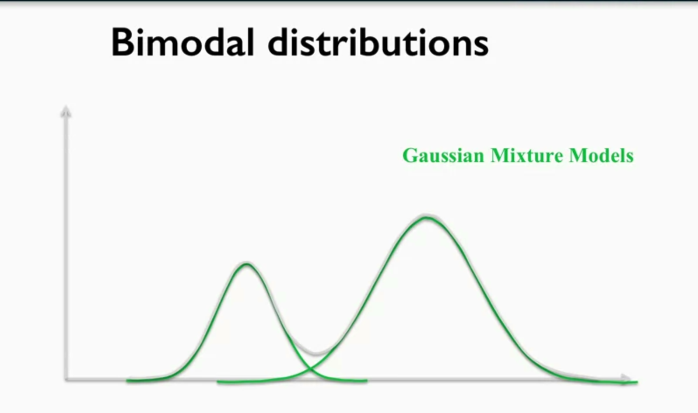
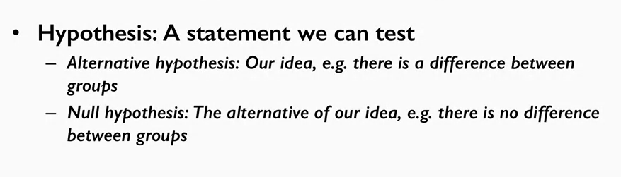
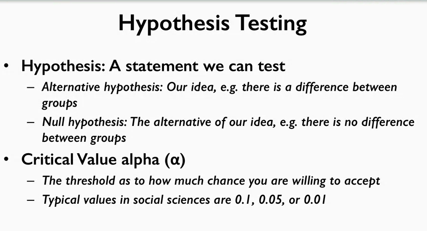
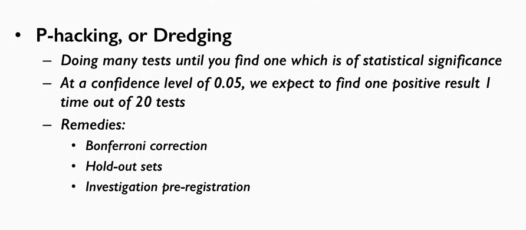

# intoduction to data science

---

#week 1

lamda  
lamda then arguments then one single expression
```py
lambda a, b, c : a + b
```

list comprehension

```py
my_list = []
for number in range(0, 1000):
    if number % 2 == 0:
        my_list.append(number)
my_list
```
same as
```py
my_list = [number for number in range(0,1000) if number % 2 == 0]
my_list
```

quick on numpy

```py
a.dtype
```

Sometimes we know the shape of an array that we want to create, but not what we want to be in it. numpy
offers several functions to create arrays with initial placeholders, such as zero's or one's.
Lets create two arrays, both the same shape but with different filler values

```py
d = np.zeros((2,3))

e = np.ones((2,3))

np.random.rand(2,3)

```
create a **sequence** of **numbers** in an array with the **arrange**()
The **fist** argument is the **starting** bound and the **second** argument is the **ending** bound, and the **third** argument is the **difference** between
each consecutive numbers
```py
np.arange(10, 50, 2)
```
if we want to generate a **sequence** of **floats**, we can use the **linspace**() function.
In this function the **third** argument isn't the difference between two numbers, but the **total number of items you want to generate**

```py
np.linspace( 0, 2, 15 ) # 15 numbers from 0 (inclusive) to 2 (inclusive)
```

### Array Operations
We can do many things on arrays, such as

1. mathematical manipulation
(addition, subtraction, square,exponents)

2. as well as use boolean arrays, which are binary values.

3. We can also do matrix manipulation such
as product, transpose, inverse, and so forth.
if we want to do elementwise product, we use the "*" sign
```py
A*B
```
if we want to do matrix product, we use the "@" sign or use the dot function
```py
A@B
```

4. Numpy arrays have many interesting aggregation functions on them, such as  sum(), max(), min(), and mean()
```py
array3.sum()
array3.max()
array3.min()
array3.mean()
```
**Now, we often think about two dimensional arrays being made up of rows and columns, but you can also think of these arrays as just a giant ordered list of numbers, and the *shape* of the array, the number of rows and columns, is just an abstraction that we have for a particular purpose. Actually, this is exactly how basic images are stored in computer environments**
---

# Week 2

it referd us to the book [learning the pandas library by matt harrison](https://mcgillmsaa.files.wordpress.com/2018/05/learning-the-pandas-library-python-tools-for-data-munging-analysis-and-visual.pdf)

he refered us to the web site  [excellen blog ](https://planetpython.org/)

missing data in pandas

```py
np.nan != None
np.nan also not  np.nan
type(np.nan) = float64
type(None) = object
```

you need to use special functions to test for the presence of not a number,
```py

np.isnan(np.nan)

```


###qeury

if you wanted to see the fourth entry we would we would use the iloc


If you wanted to see what class Molly has, we would use the loc attribute with a parameter

---

## DataFrameDataStructure

The DataFrame is conceptually a two-dimensional series object, where there's an index and multiple columns of content, with each column having a label. In fact, the distinction between a column and a row is really only a conceptual distinction. And you can think of the DataFrame itself as simply a two-axes labeled array.

 One of the powers of the Panda's DataFrame is that you can quickly select data based on multiple axes.

the first is the row index the second is the column it self
```py
df.loc['school1', 'Name']

# we also can take 2 columns
df.loc[:,['Name', 'Score']]

```


**That's selecting and projecting data from a DataFrame based on row and column labels. The key concepts to remember are that the rows and columns are really just for our benefit. Underneath this is just a two axes labeled array, and transposing the columns is easy. Also, consider the issue of chaining carefully, and try to avoid it, as it can cause unpredictable results, where your intent was to obtain a view of the data, but instead Pandas returns to you a copy.**


### drop

```py
copy_df.drop("Name", inplace=True, axis=1)
```

### columns name tips

create some function that does the cleaning and then tell renamed to apply that function across all of the data.
Python comes with a handy string function to strip white space called "strip()".
When we pass this in to rename we pass the function as the mapper parameter, and then indicate whether the axis should be columns or index (row labels)
```py
new_df=new_df.rename(mapper=str.strip, axis='columns')
```
here we are passing the refrence to that function mapper

We can also use the df.columns attribute by assigning to it a list of column names which will directly rename the columns.
This will directly modify the original dataframe and is very efficient especially when you have a lot of columns and you only want to change a few.
This technique is also not affected by subtle errors in the column names, a problem that we just encountered.
With a list, you can use the list index to change a certain value or use list comprehension to change all of the values

As an example, lets change all of the column names to lower case. First we need to get our list
```py
cols = list(df.columns)
#Then a little list comprehenshion
cols = [x.lower().strip() for x in cols] #remove all spaces and also lower all
#Then we just overwrite what is already in the .columns attribute
df.columns=cols
```
---

### QueryingDataFrame

Boolean masking is the heart of fast and efficient querying in numpy and pandas, and its analogous to bit masking used in other areas of computational science.

**A Boolean mask** is an array which can be of one dimension like a series, or two dimensions like a data frame, where each of the values in the array are **either true or false.**
This array is essentially **overlaid** on top of the data structure that we're querying.
And any cell aligned with the **true value will be admitted into our final result**, and any cell aligned with a false value will not.

example
```py
admit_mask= df['chance of admit'] > 0.7
```
just lay it on top of the
 data to "hide" the data you don't want, which is represented by all of the False values. We do this by using
 the .where() function on the original DataFrame.
```py
df.where(admit_mask).head()
```
All of the rows which did not meet the condition have NaN data instead, but these rows were not dropped from our dataset.
The next step is, if we don't want the NaN data, we use the dropna() function
```py
df.where(admit_mask).dropna().head()
```

or just use
```py
df[df['chance of admit'] > 0.7].head()
```

using the and in querying
```py
(df['chance of admit'] > 0.7) & (df['chance of admit'] < 0.9)
```


error
```py
(df['chance of admit'] > 0.7) and (df['chance of admit'] < 0.9)
df['chance of admit'] > 0.7 & df['chance of admit'] < 0.9
```

another solution
```py
df['chance of admit'].gt(0.7) & df['chance of admit'].lt(0.9)
# you can chain them too
df['chance of admit'].gt(0.7).lt(0.9)
```

####note  When you use a MultiIndex

We saw previously that the loc attribute of the DataFrame can take multiple arguments. And it could query both the
row and the columns.
When you use a MultiIndex, you must **provide** the **arguments** in **order** by the
level you **wish** to **query**. Inside of the index, each **column** is **called** a **level** and the **outermost** **column is level zero**

If we want to see the population results from **Washtenaw** **County** in **Michigan** the **state**, which is
where I live, the **first** argument would be **Michigan** and the **second** would be **Washtenaw** County
```py
df.loc['Michigan', 'Washtenaw County']
```
```py
df.loc[ [('Michigan', 'Washtenaw County'),
         ('Michigan', 'Wayne County')] ]
```
replace
```py

df.replace([1, 3], [100, 300])
```

### regular expression on DF
#### Here's my solution, first matching any number of characters then ending in .html
```py
df.replace(to_replace=".*.html$", value="webpage", regex=True)
```
### take the first and the last name
```py
def splitname(row,c):
    # The row is a single Series object which is a single row indexed by column values
    # Let's extract the firstname and create a new entry in the series
    row['First']=row['President'].split(" ")[0]
    # Let's do the same with the last word in the string
    row['Last']=row['President'].split(" ")[-1]
    # Now we just return the row and the pandas .apply() will take of merging them back into a DataFrame
    return row
df=df.apply(splitname, axis='columns')
df.head()
```

It's worth looking at the pandas str module for other functions which have been written specifically
to clean up strings in DataFrames, and you can find that in the docs in the Working with Text
section: https://pandas.pydata.org/pandas-docs/stable/user_guide/text.html

another way using Series.str.extract(pattern)

```py
pattern="(^[\w]*)(?:.* )([\w]*$)"
df["President"].str.extract(pattern).head()
```

make it more good

```py
pattern="(?P<First>^[\w]*)(?:.* )(?P<Last>[\w]*$)"

# Now call extract
names=df["President"].str.extract(pattern).head()
df["First"]=names["First"]
df["Last"]=names["Last"]

```

Now lets move on to clean up that Born column. First, let's get rid of anything that isn't in the
pattern of Month Day and Year.
```py
df["Born"]=df["Born"].str.extract("([\w]{3} [\w]{1,2}, [\w]{4})")
```
or
```py
df["Born"]=pd.to_datetime(df["Born"])
```


---

#week 3

## how to merge data
use
```py
df1
df2
how = "inner" , "outer" , "left" , "right"
left_index = True or left_on='column1'
right_index = True or right_on='column2'

pd.merge()
```
### Note

**u dont need index to use merge u can use columns it selfs **

```py
pd.merge(staff_df, student_df, how='left', left_on='Name', right_on='Name')
```


### what happens when we have conflicts between the DataFrames?

The merge function preserves this
information, but appends an _x or_y to help differentiate between which index went with which column of data.

The _x is always the left DataFrame information, and the _ y is always the right DataFrame information.

### Note multi indexes

we can use 2 indecs to join
```py
pd.merge(staff_df, student_df, how='inner', left_on=['First Name','Last Name'], right_on=['First Name','Last Name'])
```

### joining "vertically"
meaning we put dataframes on top or at the bottom of each other
```py
frames = [df_2011, df_2012, df_2013]
pd.concat(frames)
```


---

## Idiomatic Pandas: Making Code Pandorable

An idiomatic solution is often one which has both high performance and high readability.

### method chaining
 The general idea behind method chaining is that every method on an object returns a reference to that object.


chain indexing
```py
df.loc["column1"]['column2']
```
it's bad pandas return a copy of a view depending upon the numpy


it's better to do some thing called method chaining
```py
(df.where(df['SUMLEV']==50)
    .dropna()
    .set_index(['STNAME','CTYNAME'])
    .rename(columns={'ESTIMATESBASE2010': 'Estimates Base 2010'}))
```
tradintional way not good but it's working

```py
# First create a new dataframe from the original
df = df[df['SUMLEV']==50] # I'll use the overloaded indexing operator [] which drops nans
# Update the dataframe to have a new index, we use inplace=True to do this in place
df.set_index(['STNAME','CTYNAME'], inplace=True)
# Set the column names
df.rename(columns={'ESTIMATESBASE2010': 'Estimates Base 2010'})
```


#fucntion Map: apply
it's noticable to understand the fucntion Map

and applymap

apply

example 1
```py
import numpy as np
def min_max(row):
    data = row[['POPESTIMATE2010',
                'POPESTIMATE2011',
                'POPESTIMATE2012',
                'POPESTIMATE2013',
                'POPESTIMATE2014',
                'POPESTIMATE2015']]
    row['max'] = np.max(data)
    row['min'] = np.min(data)
    return row
df.apply(min_max, axis='columns')
```
better
```py
rows = ['POPESTIMATE2010',
        'POPESTIMATE2011',
        'POPESTIMATE2012',
        'POPESTIMATE2013',
        'POPESTIMATE2014',
        'POPESTIMATE2015']
df.apply(lambda x: np.max(x[rows]), axis='columns')
```

The beauty of the apply function is that it allows flexibility in doing whatever manipulation that you desire, as the function you pass into apply can be any customized however you want.


divide into

```py
def get_state_region(x):
    northeast = ['Connecticut', 'Maine', 'Massachusetts', 'New Hampshire',
                 'Rhode Island','Vermont','New York','New Jersey','Pennsylvania']
    midwest = ['Illinois','Indiana','Michigan','Ohio','Wisconsin','Iowa',
               'Kansas','Minnesota','Missouri','Nebraska','North Dakota',
               'South Dakota']
    south = ['Delaware','Florida','Georgia','Maryland','North Carolina',
             'South Carolina','Virginia','District of Columbia','West Virginia',
             'Alabama','Kentucky','Mississippi','Tennessee','Arkansas',
             'Louisiana','Oklahoma','Texas']
    west = ['Arizona','Colorado','Idaho','Montana','Nevada','New Mexico','Utah',
            'Wyoming','Alaska','California','Hawaii','Oregon','Washington']

    if x in northeast:
        return "Northeast"
    elif x in midwest:
        return "Midwest"
    elif x in south:
        return "South"
    else:
        return "West"
df['state_region'] = df['STNAME'].apply(lambda x: get_state_region(x))
```


### to improve coding
Go look at some of the top ranked
questions on pandas on Stack Overflow, and look at how some of the more experienced
authors, answer those questions.

---
## group by
This function takes some column name or names and splits the dataframe up into
chunks based on those names,
it returns a dataframe group by object.
Which can be iterated upon, and
then returns a tuple where the first
item is the group condition,
and the second item is the data
frame reduced by that grouping.
(condition, hole data frame reduced by the grouping)

```py
for group, frame in df.groupby('STNAME'):
  #here we can see the in the froupby object we have
  # key
  #projected dataframe that was found for that group
```
the key is the one of the values that the group by return from the orignial data frame
the frame is the complete frame with the "what we grouped by" is equal to it


### note group by and use that to segment your data.
99% of the time, you'll use group by on one or more columns.
But you can actually provide a function to group by as well and
use that to **segment your data.**

### note
It's important to note that in order
to do this you need to set the index of
the data frame to be the column
that you want to group by first.
### code

```py
df = df.set_index('STNAME')

def set_batch_number(item):
    if item[0]<'M':
        return 0
    if item[0]<'Q':
        return 1
    return 2

for group, frame in df.groupby(set_batch_number):
    print('There are ' + str(len(frame)) + ' records in group ' + str(group) + ' for processing.')

```
Notice that this time I didn't pass in a column name to groupby(). Instead, I set the index of the dataframe to be STNAME, and if no column identifier is passed groupby() will automatically use the index.

#### note  So, how would I group by both of these columns? A first approach might be to promote them to a multiindex and just call groupby()

```py
df=df.set_index(["cancellation_policy","review_scores_value"])
for group, frame in df.groupby(level=(0,1)):
    print(group)
```
#### note more complex grouping
This seems to work ok. But what if we wanted to group by the cancelation policy and review scores, **but separate out all the 10's from those under ten?** In this case, we could use a **function** to manage the
groupings and apply to the groupby

```py
def grouping_fun(item):
    # Check the "review_scores_value" portion of the index. item is in the format of
    # (cancellation_policy,review_scores_value
    if item[1] == 10.0:
        return (item[0],"10.0")
    else:
        return (item[0],"not 10.0")

for group, frame in df.groupby(by=grouping_fun):
    print(group)
```

### Aggregation

```py
df.groupby("cancellation_policy").agg({"review_scores_value":np.average})
```
##### note
np.average does not ignore nans!
there is a function we can use for this
```py
df.groupby("cancellation_policy").agg({"review_scores_value":np.nanmean})
```
We can just extend this dictionary to aggregate by multiple functions or multiple columns.
```py
df.groupby("cancellation_policy").agg({"review_scores_value":(np.nanmean,np.nanstd),
                                      "reviews_per_month":np.nanmean})
```
The agg function is going to apply one or more
functions we specify to the group dataframes and return a single row per dataframe/group.

### Transformation
 Transformation is different from aggregation. Where agg() returns a single value per column, so one row per
 group,

 **tranform()** returns an object that is the same size as the group. Essentially, it broadcasts the
 function you supply over the grouped dataframe, returning a **new** **dataframe**. This makes **combining** **data** **later**
 **easy**.
من الاخر بيوزع النتيجه على كله

####example

 For instance, suppose we want to include the average rating values in a given group by cancellation policy,
 but preserve the dataframe shape so that we could generate a difference between an individual observation
 and the sum.
```py
# First, lets define just some subset of columns we are interested in
cols=['cancellation_policy','review_scores_value']
# Now lets transform it, I'll store this in its own dataframe
transform_df=df[cols].groupby('cancellation_policy').transform(np.nanmean)

#So lets just join this in. Before we do that, lets rename the column in the transformed version
transform_df.rename({'review_scores_value':'mean_review_scores'}, axis='columns', inplace=True)
df=df.merge(transform_df, left_index=True, right_index=True)
```

#### why we use it
 Great, we can see that our new column is in place, the mean_review_scores. So now we could create, for
 instance, the difference between a given row and it's group (the cancellation policy) means.
```py
df['mean_diff']=np.absolute(df['review_scores_value']-df['mean_review_scores'])
```
the transform


the agg


### Filtering

The GroupBy object has build in support for **filtering** groups as well. It's often that you'll want to group
by some feature, then make some **transformation** to the groups, then drop certain groups as part of your
cleaning routines. **The filter()** function takes in a function which it applies to each group dataframe and
returns** either a True or a False**, depending upon whether that group should be included in the results.

 For instance, if we only want those groups which have a mean rating above 9 included in our results
 ```py
df.groupby('cancellation_policy').filter(lambda x: np.nanmean(x['review_scores_value'])>9.2)
```
### Applying

By far the most common operation I invoke on groupby objects is the apply() function. This allows you to
apply an arbitrary function to each group, and stitch the results back for each apply() into a single
 dataframe where the index is preserved.

```py
# And lets just include some of the columns we were interested in previously
df=df[['cancellation_policy','review_scores_value']]
```
 In previous work we wanted to find the average review score of a listing and its deviation from the group
 mean. This was a two step process, first we used transform() on the groupby object and then we had to
 broadcast to create a new column. With apply() we could wrap this logic in one place

 ```py
 def calc_mean_review_scores(group):
    # group is a dataframe just of whatever we have grouped by, e.g. cancellation policy, so we can treat
    # this as the complete dataframe
    avg=np.nanmean(group["review_scores_value"])
    # now broadcast our formula and create a new column
    group["review_scores_mean"]=np.abs(avg-group["review_scores_value"])
    return group

# Now just apply this to the groups
df.groupby('cancellation_policy').apply(calc_mean_review_scores).head()
```


#### note
Using apply can be slower than using some of the specialized functions, especially agg(). But, if your
 dataframes are not huge, it's a solid general purpose approach


----
## scales

1. Nominal Scale.
- categorical data
- There are a limited number of teams but changing their order or playing mathematical function to them is meaningless.
- we generally refer to categories where there are only two possible values as binary.

   Nominal variables (also called categorical variables) can be placed into categories. They don’t have a numeric value and so cannot be added, subtracted, divided or multiplied. They also have no order; if they appear to have an order then you probably have ordinal variables instead.

2. Ordinal Scale.
- the order
of values is important
- the differences between the values
are not equally spaced.
- grading method
- **Ordinal data is very common in machine learning and can sometimes be a challenge to work with.**

   The ordinal scale contains things that you can place in order. For example, hottest to coldest, lightest to heaviest, richest to poorest. Basically, if you can rank data by 1st, 2nd, 3rd place (and so on), then you have data that’s on an ordinal scale.

3. Interval Scale.
- units are equally spaced
- no clear absence of value. no True zero
- the temperatures measured in Celsius or Fahrenheit.

   An interval scale has ordered numbers with meaningful divisions. Temperature is on the interval scale: a difference of 10 degrees between 90 and 100 means the same as 10 degrees between 150 and 160. Compare that to high school ranking (which is ordinal), where the difference between 1st and 2nd might be .01 and between 10th and 11th .5. If you have meaningful divisions, you have something on the interval scale.

4. Ratio Scale.
- measurements units are equally spaced and mathematical
- operations, such as subtract, division,
and multiplication are all valid.
- height and weight.

   The ratio scale is exactly the same as the interval scale with one major difference: zero is meaningful. For example, a height of zero is meaningful (it means you don’t exist). Compare that to a temperature of zero, which while it exists, it doesn’t mean anything in particular (although admittedly, in the Celsius scale it’s the freezing point for water).


```py
df['column'].astype("category").head()
#>c
# ok	C+
# ok	C-
# poor	D+
# poor	D

my_categories=pd.CategoricalDtype(categories=['D', 'D+', 'C-', 'C', 'C+', 'B-', 'B', 'B+', 'A-', 'A', 'A+'],
                           ordered=True)
# then we can just pass this to the astype() function
df['column'].astype(my_categories)
#>C
# excellent    A+
# excellent     A
# excellent    A-
# good         B+
# good          B
# good         B-
# ok           C+
```

Sometimes it is useful to represent **categorical** values as each being a column with a true or a false as to
whether the category applies.
This is especially common in feature extraction, which is a topic in the **data**
**mining** course. Variables with a **boolean** value are typically called **dummy** **variables**, and pandas has a built
in function called `get_dummies` which will convert the values of a single column into multiple columns of
zeros and ones indicating the presence of the dummy variable. I rarely use it, but when I do it's very
handy.

Now, cutting is just one way to build categories from your data, and there are many other methods. For
instance, cut gives you interval data, where the spacing between each category is equal sized. But sometimes
you want to form categories based on frequency – you want the number of items in each bin to the be the
same, instead of the spacing between bins. It really depends on what the shape of your data is, and what
you’re planning to do with it.


###Pivot tables
A pivot table is a way of summarizing data in a DataFrame for a particular purpose. It makes heavy use of the aggregation function. A pivot table is itself a DataFrame, where the rows represent one variable that you're interested in, the columns another, and the cell's some aggregate value. A pivot table also tends to includes marginal values as well, which are the sums for each column and row. This allows you to be able to see the relationship between two variables at just a glance.

A pivot table allows us to pivot out one of these columns a new column headers and compare it against
another column as row indices. Let's say we want to compare rank level versus country of the universities
and we want to compare in terms of overall score

To do this, we tell Pandas we want the values to be Score, and index to be the country and the columns to be
the rank levels. Then we specify that the aggregation function, and here we'll use the NumPy mean to get the
average rating for universities in that country
```py
df.pivot_table(values='score', index='country', columns='Rank_Level', aggfunc=[np.mean]).head()
df.pivot_table(values='score', index='country', columns='Rank_Level', aggfunc=[np.mean, np.max]).head()
df.pivot_table(values='score', index='country', columns='Rank_Level', aggfunc=[np.mean, np.max],
               margins=True).head()
# What if we want to find the country that has the maximum average score on First Tier Top University level?
# We can use the idxmax() function.
new_df['mean']['First Tier Top Unversity'].idxmax()
```
#### note
If you want to achieve a different shape of your pivot table, you can do so with the stack and unstack
functions. Stacking is pivoting the lowermost column index to become the innermost row index. Unstacking is
the inverse of stacking, pivoting the innermost row index to become the lowermost column index. An example
will help make this clear

let's try stacking, this should move the lowermost column, so the tiers of the university rankings, to the inner most row
```py
new_df=new_df.stack()
```


---
## time in python
In today's lecture, where we'll be looking at the time series and date functionally in pandas. Manipulating dates and time is quite flexible in Pandas and thus allows us to conduct more analysis such as time series analysis, which we will talk about soon. Actually, pandas was originally created by Wed McKinney to handle date and time data when he worked as a consultant for hedge funds.
Pandas has four main time related classes.
1. Timestamp
2. DatetimeIndex
3. Period
4. PeriodIndex


### Timestamp

point of time
```py
pd.Timestamp('9/1/2016 10:05AM')
pd.Timestamp(2019, 12, 20, 0, 0)

pd.Timestamp(2019, 12, 20, 0, 0).isoweekday()


pd.Timestamp(2019, 12, 20, 5, 2,23).second
```
such as isoweekday(), which shows the weekday of the timestamp
note that 1 represents Monday and 7 represents Sunday

 You can find extract the specific year, month, day, hour, minute, second from a timestamp


### period
span of time specfic date or month

```py
pd.Period('1/2016')
pd.Period('3/5/2016')
```
Period objects represent the full timespan that you specify. Arithmetic on period is very easy and
intuitive, for instance, if we want to find out 5 months after January 2016, we simply plus 5
```py
pd.Period('1/2016') + 5
pd.Period('3/5/2016') - 2
```

### DatetimeIndex
it's time stamp index

### PeriodIndex
 it's a period index


### Converting to Datetime
```py
pd.to_datetime('column')
pd.to_datetime(df.index)
```
 to order

```py
pd.to_datetime('4.7.12', dayfirst=True)
```

### Timedeltas
it's the differences in time

```py
pd.Timestamp('9/3/2016')-pd.Timestamp('9/1/2016')

pd.Timestamp('9/2/2016 8:10AM') + pd.Timedelta('12D 3H')
```
### offset
similar to timedelta, but it follows specific calendar duration rules

```py
pd.Timestamp('9/4/2016') + pd.offsets.Week()
pd.Timestamp('9/4/2016') + pd.offsets.MonthEnd()
```


---
## Working with Dates in a Dataframe

creat date time index
```py
pd.date_range('10-01-2016', periods=9, freq='2W-SUN')
```

freq =
```py
freq='2W-SUN' #biweekly on Sunday
freq='B' #business day
freq='QS-JUN' #quarter start in June
```
check what day of the week a specific date is
```py
df.index.weekday_name
```
find the difference between each date's value.

```py
df.diff()
```


the day it self
```py
df.index.day_name()
```

### find the mean for each month

```py
df.resample('M').mean()
```

### find value for particular year or month as long as the date is the index

```py
df['2017']

df['2016-12']

df['2016-12':]

```


### change the frequnecy of the dates in our DataFrame

```py
df.asfreq('W', method='ffill')
```


# week 4

week project to test the ability that i have learnt

### scipy
is an interesting collection of libraries for data science and you'll use most or perpahs all of
these libraries. It includes numpy and pandas, but also plotting libraries such as matplotlib, and a
number of scientific library functions as well
```py
from scipy import stats
```

test the binomial distribution

```py
n = 'number of times to run '
p = ' probability that it lands for the 0 condition'
np.random.binomial(N, p)
```
the modern computional power allows us to simulate the effects of different parameters in the distribution

we dont have to work with the math we can just simulate e the problem instead and see the results
### bimodel distribution
have 2 or more peaks


in the end her refered to Allen B. Downey book [thinkstats](https://greenteapress.com/thinkstats2/thinkstats2.pdf)


### Hypothesis Testing
is a core data analysis activity behind experimentation.

A hypothesis is a statement that we can test.

####case


We then examine the groups to determine
whether this null hypothesis is
true or not.

If we find that there is
a difference between groups,
then we can reject the null hypothesis and
we accept our alternative(our IDEA).

If we look at the mean values for
the late data frame as well, we get surprisingly similar numbers.

But, are they the same? What do we mean by similar?

This is where the students' t-test comes in.
It allows us to **form** the alternative hypothesis ("These are different") as well
as the **null** hypothesis ("These are the same") and then **test** that **null** **hypothesis**.


When doing hypothesis testing, we have to choose a **significance level** as a threshold for how much of a
**chance** we're willing to accept. This significance level is typically called alpha. #For this example, let's
use a **threshold of 0.05** for our alpha or 5%. Now this is a commonly used number but it's really quite
arbitrary.


The SciPy library contains a number of different statistical tests and forms a basis for hypothesis testing
in Python and we're going to use the **ttest_ind()** function which does an independent t-test (meaning the
populations are not related to one another). The result of **ttest_index**() are the **t-statistic and a p-value.**
It's this latter value, the probability, which is most important to us, as it indicates the chance (between
0 and 1) of our null hypothesis being True.


So here we see that the **probability** is** 0.18** **>** of **0.05**. This means that we
**cannot** **reject** the **null** hypothesis. The null hypothesis was that the two populations are the same, and we
don't have enough certainty in our evidence (**because it is greater than alpha**) to come to a conclusion to
the contrary. This doesn't mean that we have proven the populations are the same.

#### threshold

When doing hypothesis testing, we have to
choose a significance level as a threshold for how much of a chance
we're willing to accept.
This significance level is
typically called **alpha.**


which indicates a tolerance for
a probability of between 5% and
1% of chance.

In a physics experiment where the
conditions are much more controlled and
thus, the burden of proof is much higher,
you might expect to see alpha
levels of 10 to the negative 5 or
100,000th of a percentage.

For this example, let's use a threshold
of 0.05 for our alpha or 5%.

### test the hypothesis
The SciPy library contains a number
of different statistical tests and
forms a basis for
hypothesis testing in Python.

A **T test** is one way to compare
the means of two different populations.
In the SciPy library,
the T test end function will
compare two independent samples to
see if they have different means.

#### code
```py
stats.ttest_ind(early['assignment1_grade'], late['assignment1_grade'])
```
The result is a two with a test
statistic and a p-value.

The p-value here is much
larger than our 0.05.
So we cannot reject the null hypothesis(our idea was wrong if the null is true)

we need a p value of .05 or less to reject the null and say that our idea is good

#### p hacking



In this lecture, we've discussed just some of the basics of hypothesis testing in Python. I introduced you to the SciPy library, which you can use for the students t test. We've discussed some of the practical issues which arise from looking for statistical significance. There's much more to learn about hypothesis testing, for instance, there are different tests used, depending on the shape of your data and different ways to report results instead of just p-values such as confidence intervals or bayesian analyses. But this should give you a basic idea of where to start when comparing two populations for differences, which is a common task for data scientists.
