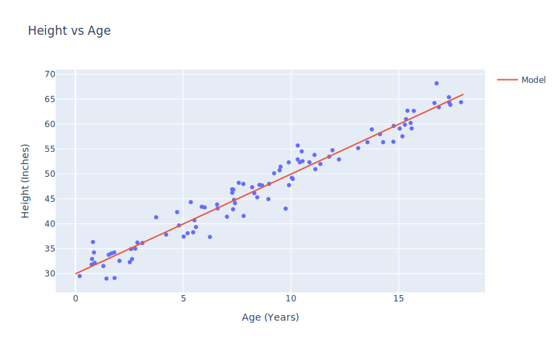
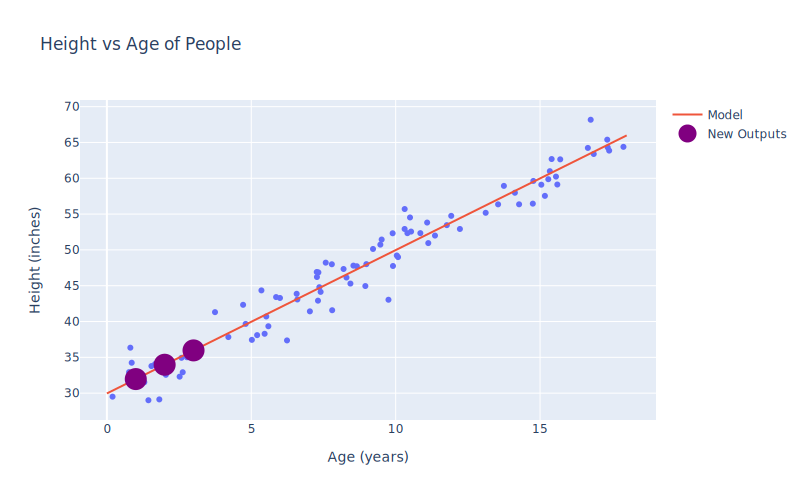
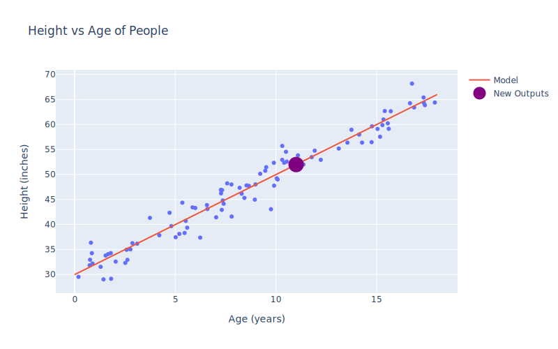
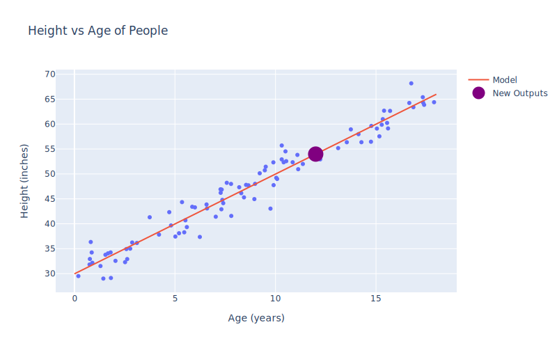

# description
in this folder i made small flask app that uses a linear Machine learning model to predict the height based on the age of the person  

# libraries used 

* pandas > to read the data 
* numpy > to convirt it into usable form
* flask > deploy the model 
* joblib > to save and load the model 
* sklean > to train the model 
* uuid > create random names 

# examples 

the Base model with original 

some predictions examples 

